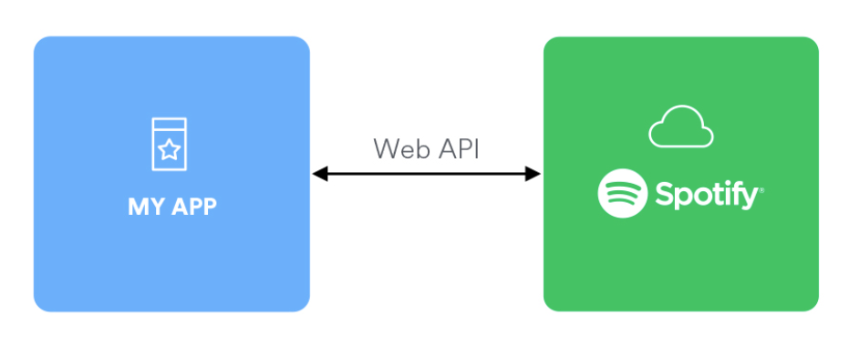
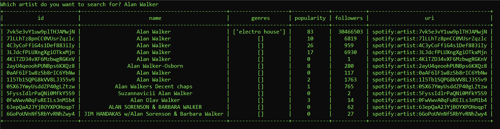
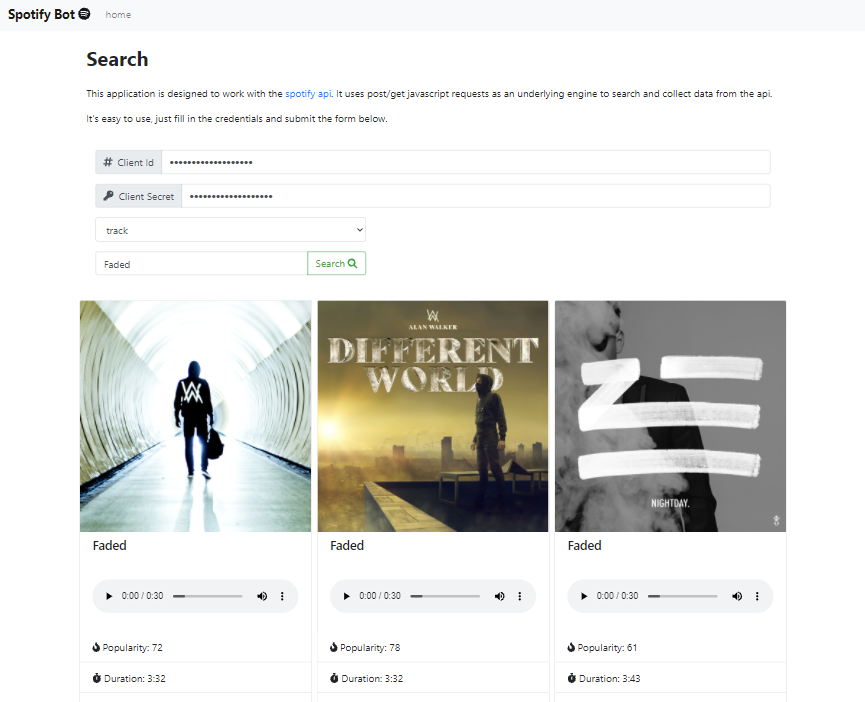

# spotify-api
## Description
This is an assignment I made for my course: Emerging Technologies. I had to create a cmd-interface which can query the spotify api. I used [python3.8](https://www.python.org/downloads/release/python-380/) as underlying engine. 
  
  
  
I made my own expansion on this assignment, which is the webapplication. I used javascript to query the spotify api and visualize it in the brower. You can search for tracks and artists.

## Setup
**1. Request api keys**  
First you will need to [request an application](https://developer.spotify.com/documentation/general/guides/app-settings/#register-your-app). Register a spotify account and find your client-id and client-secret.

**2. Download repo**  
Next, you need to download this repo. You can do so with the following command:  
`$ git clone https://github.com/WarreKiekens/spotify-api.git`

## CMD
### Installation
Navigate to the cmd project.  
`$ cd cmd`  

Create the virtual environment which we will use to install the modules in.  
`$ python -m venv .env`  

Activate the virtual environment.  
`$ .env\Scripts\activate`  

Next, you will need to install the modules, which are located in requirements.txt.  
`$ pip install -r requirements.txt`  

### Setup  
Fill in your client-id and client-secret in [credentials.json](cmd/credentials.json).  
```json
{  
  "client-id": "",  
  "client-secret": ""  
}  
```  
Last step is to run the program, you can do this with following command:  
`$ python spotifybot.py`  
  
  
  
  
## Webapplication
### Setup
No extra installation is required, you only need to open the index.html and fill in the form.  
`$ webapplication\index.html`  
  
  


